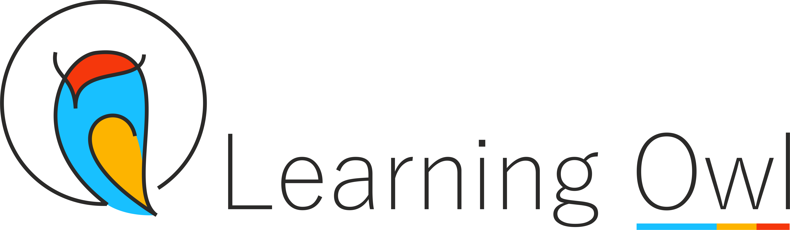

<div align="center">



<br/>

# OwlConverter

**Convert SWF files to MP4 — fast, local, and watermark-ready**

[](LICENSE)
[](https://github.com/hardiklearningowl/owl-converter/releases)
[](https://electronjs.org)
[](https://react.dev)
[](https://github.com/hardiklearningowl/owl-converter/releases)


<table>
<tr>
<td align="center" width="33%"></td>
<td align="center" width="33%"></td>
<td align="center" width="33%"></td>
</tr>
</table>

</div>

---

## What is OwlConverter?

OwlConverter is a **free, open-source Windows desktop app** that converts Adobe Flash (SWF) animation files to MP4. Built by [Learning Owl](https://learningowl.in) for eLearning teams who need a fast, no-hassle way to modernise their SWF content — no Adobe products required, no cloud upload, no subscription.

> **Everything runs locally on your machine.** No data leaves your computer.

---

## Features

### 🎬 Conversion Modes
| Mode | Description |
|------|-------------|
| **Batch** | Convert multiple SWFs in one go — each gets its own MP4 |
| **Merge** | Stitch multiple SWFs into a single MP4 in your chosen order |

### 🎛️ Quality Control
| Setting | Options |
|---------|---------|
| **Resolution** | Original · 480p · 720p · 1080p |
| **Quality (CRF)** | Lossless (12) · High (18) · Medium (23) · Low (28) |
| **Frame Rate** | Match source · 24fps · 30fps · 60fps |
| **GPU Acceleration** | Auto-detects NVIDIA NVENC / Intel QSV, falls back to CPU |

### 💧 Watermark
- Learning Owl logo applied by default (PNG, FFmpeg overlay)
- 6 position presets: TL · TC · TR · BL · BC · **BR** (default)
- Custom logo support — upload any PNG
- Adjustable opacity (10–100%) and size (Small / Medium / Large)

### 📋 Queue
- Drag-and-drop SWF files directly onto the window
- Reorder files before conversion
- Pause / Resume the queue at any time
- Failed files show an inline retry button — never block the queue
- Queue survives app close and crash (saved to disk)

### 📜 History
- Last 100 conversions stored locally
- Re-add any source file to the queue with one click
- View output size, date, and duration per conversion

### 🔄 Auto-Update
- Checks GitHub Releases on startup and every 4 hours
- Non-intrusive banner — never interrupts a conversion
- Can be disabled in Settings

---

## Installation

### Download (Windows)

**[⬇ OwlConverter-Setup-1.0.0.exe](https://github.com/hardiklearningowl/owl-converter/releases/latest/download/OwlConverter-Setup-1.0.0.exe)**

One-click installer — no restart required. Adobe AIR and FFmpeg are bundled; nothing else to install.

➡ **[All releases →](https://github.com/hardiklearningowl/owl-converter/releases)**

### Build from Source

**Prerequisites:** Node.js 20+, Git

```bash
# 1. Clone the repo
git clone https://github.com/hardiklearningowl/owl-converter.git
cd owl-converter

# 2. Install dependencies
npm install

# 3. Start in development mode
npm run dev
```

To build a distributable installer:
```bash
npm run fetch-binaries   # Download Swivel CLI + FFmpeg
npm run build            # Build renderer
npm run dist             # Package with electron-builder → release/
```

---

## How It Works

```
SWF file
  └─► Swivel CLI  →  raw MP4  (vector rendering at source resolution)
        └─► FFmpeg  →  final MP4  (scale · CRF encode · watermark overlay)
              └─► Output folder
```

**Merge mode:**
```
SWF files (in queue order)
  └─► Swivel CLI  →  raw MP4 per file  (temp folder)
        └─► FFmpeg concat  →  merged MP4
              └─► FFmpeg encode  →  final MP4  (quality · watermark)
                    └─► Output folder
```

---

## Tech Stack

| Layer | Technology |
|-------|-----------|
| Desktop shell | [Electron 28](https://electronjs.org) |
| UI | [React 18](https://react.dev) + [Tailwind CSS 3](https://tailwindcss.com) |
| State | [Zustand](https://zustand-demo.pmnd.rs) |
| SWF rendering | [Swivel CLI](https://github.com/hardiklearningowl/swivel) (forked) |
| Video processing | [FFmpeg](https://ffmpeg.org) (static Windows build) |
| Persistence | [electron-store](https://github.com/sindresorhus/electron-store) |
| Auto-update | [electron-updater](https://www.electron.build/auto-update) |
| Installer | [electron-builder](https://www.electron.build) (NSIS) |

---

## Project Structure

```
owl-converter/
  src/
    main/           # Electron main process (Node.js)
    renderer/       # React UI (Vite)
      components/
        QueuePanel/
        SettingsPanel.jsx
        WatermarkPicker.jsx
        StatusBar.jsx
        HistoryPanel.jsx
        TitleBar.jsx
        Toolbar.jsx
  assets/
    watermarks/
      default.png   # Learning Owl watermark logo
  binaries/         # swivel-cli.exe + ffmpeg.exe (fetched at build, not committed)
  scripts/
    fetch-binaries.js
  .github/
    workflows/
      build.yml     # CI: builds installer on v*.*.* tag push
```

---

## Limitations (v1)

- Windows only (macOS / Linux planned for v2)
- SWF files with ActionScript interactivity are **not** supported (Swivel renders animation only)
- Sequential processing — one file at a time to stay within 8GB RAM machines

---

## Contributing

Pull requests are welcome. For major changes, please open an issue first to discuss what you'd like to change.

```bash
npm test   # Run unit tests (Vitest)
```

---

## License

[MIT](LICENSE) — free to use, modify, and distribute.

---

<div align="center">

Built with ❤️ by [Learning Owl](https://learningowl.in) — Mumbai, India


*Empowering eLearning teams to move forward — one conversion at a time.*

</div>
